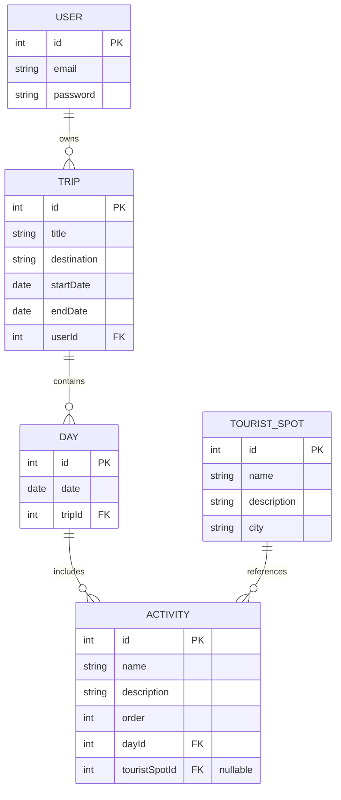

# 📐 Software Design Document (SDD) - Travel Planner

**Projeto:** Travel Planner  
**Versão:** 1.0.0  
**Status:** 🟢 Pronto para Implementação  
**Stack Principal:** NestJS, React (Vite), Prisma ORM, PostgreSQL  

---

## 🏗️ 1. Arquitetura do Sistema (Monorepo)

O projeto utiliza arquitetura Monorepo.

- `apps/api` → Backend (NestJS)
- `apps/web` → Frontend (React + Vite)

---

## 🤖 2. Orquestração e Ecossistema (MCP)

> **Instrução para a IA:** Sempre utilizar MCP antes de sugerir mudanças estruturais.

- **GitHub MCP:** Criar e atualizar Issues e Kanban
- **Neon MCP:** Gerenciar banco PostgreSQL
- **Prisma ORM:** Interface com banco de dados

---

## 📦 3. Stack Tecnológica e Versões

### Core
- Node.js v20.x
- PostgreSQL 16 (Neon.tech)
- NestJS v10.x
- React (Vite)

### Backend
- Prisma ORM v5.x
- JWT Auth (`@nestjs/jwt`)
- Validation (`class-validator`)
- Swagger (`@nestjs/swagger`)

---

## 🗄️ 4. Arquitetura de Dados

### 📖 Glossário

| PT-BR | EN |
|------|----|
| Usuário | User |
| Viagem | Trip |
| Dia | Day |
| Atividade | Activity |

---

### 🧩 Diagrama



---

## 🔗 Relacionamentos

- USER 1:N TRIP → um usuário pode ter várias viagens
- TRIP 1:N DAY → uma viagem possui vários dias
- DAY 1:N ACTIVITY → um dia possui várias atividades
- TOURIST_SPOT 1:N ACTIVITY → um ponto turístico pode estar associado a várias atividades
- ACTIVITY → pode ou não estar vinculada a um ponto turístico (relação opcional)

--- 

## 📑 5. DTOs (Contratos Globais)

- RegisterDTO → `{ email, password }`
- LoginDTO → `{ email, password }`
- CreateTripDTO → `{ title, destination, startDate, endDate }`
- CreateTouristSpotDTO → `{ name, description, city }`
- CreateDayDTO → `{ date }`
- CreateActivityDTO → `{ name, description, order, touristSpotId? }`

---

## 🏗️ 6. Arquitetura Backend

> **Instrução para a IA:** Seguir padrão NestJS CLI

```
src/
  auth/
  trips/
  days/
  activities/
  common/
  prisma/
```

---

## 🛡️ 7. Segurança

- JWT obrigatório
- Usuário só acessa seus dados
- ValidationPipe global
- ExceptionFilter global

Formato de erro:

```json
{
  "statusCode": 400,
  "timestamp": "2026-01-01",
  "path": "/api",
  "message": "Erro"
}
```

---

## 📡 8. Contratos de API

### Auth

POST `/auth/register`

```json
{
  "email": "string",
  "password": "string"
}
```

POST `/auth/login`

```json
{
  "access_token": "jwt"
}
```

---

### Trips

GET `/trips`

POST `/trips`

```json
{
  "title": "Viagem",
  "startDate": "2026-05-01",
  "endDate": "2026-05-05"
}
```

PUT `/trips/:id`  
DELETE `/trips/:id`

---

### Days

POST `/trips/:tripId/days`

---

### Tourist Spot

POST `/tourist-spots`

```json
{
  "name": "Cristo Redentor",
  "description": "Ponto turístico famoso",
  "city": "Rio de Janeiro"
}
```

---

### Activities

POST `/days/:dayId/activities`

---

## ⚙️ 9. Environment

```
DATABASE_URL=
JWT_SECRET=
JWT_EXPIRES_IN=8h
```